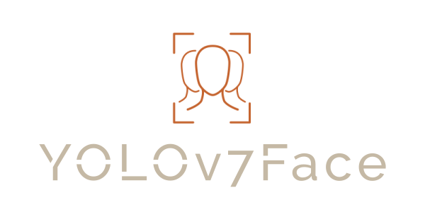
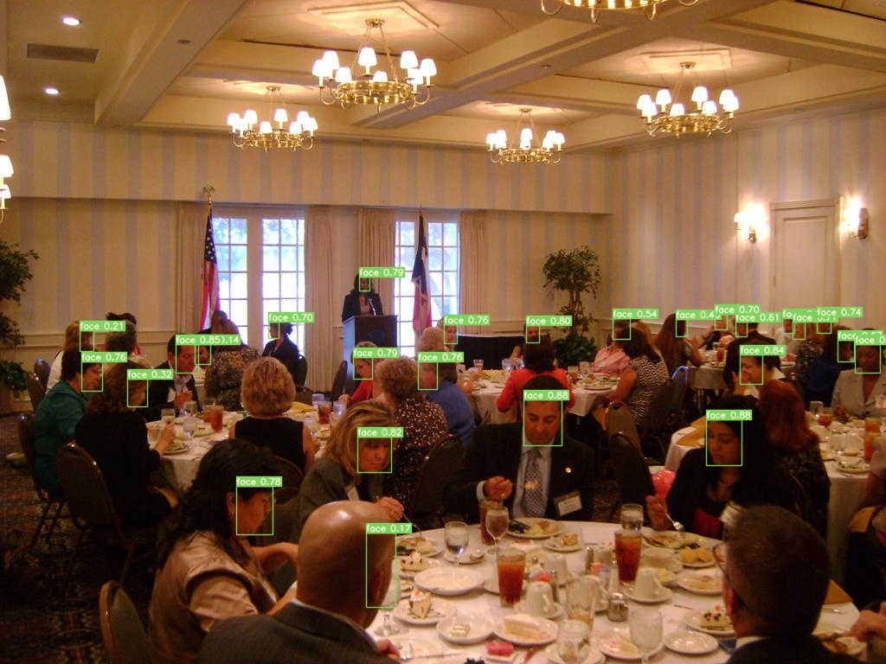

# YOLOv7 Face





## Introduction
YOLOv7 Face is a Python library to perform face detection and anonymization using YOLOv7 models. If employed with
a good model, it can facilitate implementing face detection and anonymization for surveillance cameras and other
computer vision applications.

## Install
The easiest way to install the YOLOv7Face is by using `pip`:
```commandline
pip install git+https://github.com/msamsami/yolov7face
```

## Getting Started
You can set your face detector and anonymizer up and running by following these steps:

### Define model configurations
First, you need to define your face detector model configurations by initializing and instance of `YOLOv7Configs`
class. This class requires a `weights` parameter which can be set in multiple ways. If you already have a 
pre-trained YOLOv7 model, simply pass the path to its *.pt file:
```python
from yolov7face import YOLOv7Configs

model_configs = YOLOv7Configs(
    weights='my_models/face_detector.pt',
    cfg='widerface.yaml'
)
```

If the *.pt file is available online rather than your local drive, or you want to keep your model information
(e.g., name, version, URL, author, etc.) in a maintainable way, you may want to use the `YOLOv7Model` class which
is used to maintain YOLOv7 models. By passing a `filepath` and a `url` parameter to this class, if the model
object is not found in the filepath, it will be automatically downloaded from the URL and saved to the filepath.
After defining your model as a `YOLOv7Model` instance, you can pass it to the `weights` parameter of `YOLOv7Configs`:

```python
from yolov7face import YOLOv7Model, YOLOv7Configs

my_model = YOLOv7Model(
    name="Awesome Face Detector",
    filepath='my_models/awesome_face_detector.pt',
    url="https://mystorage.blob.core.windows.net/models/yolov7-face-detector.pt",
    version="0.0.14",
    author="Johnny Cash"
)

model_configs = YOLOv7Configs(weights=my_model, cfg='widerface.yaml')
```

In case you don't have your own pre-trained face detector model, you can use one of the pre-trained models
that comes with the library:

```python
from yolov7face import YOLOV7_WIDERFACE_MODEL, YOLOv7Configs

model_configs = YOLOv7Configs(weights=YOLOV7_WIDERFACE_MODEL, cfg='widerface.yaml')
```

### Define anonymizer configurations

**NOTE**: If you don't want to apply any anonymization to detected faces, you can skip this step.


In this step, you should define the face anonymizer configuration if you want to anonymize the faces detected
by the model. This can be done by creating an instance of the `FaceAnonymizer` class. The face anonymizer
currently supports three types of anonymization:
- Blurring (`method='blur'`)
- Pixelation (`method='pixelate'`)
- Block-out (`method='block'`)

```python
from yolov7face import FaceAnonymizer

anonymizer = FaceAnonymizer(method='blur', blur_kernel_size=(19, 19), blur_sigma_x=45, blur_sigma_y=45)
```

## Inference

### Face detection

Now that face detector configurations are defined, you can initialize your face detector by creating an instance
of the `YOLOv7Face` class and using it for inference:

```python
from yolov7face import YOLOv7Face, YOLOv7Configs, YOLOV7_WIDERFACE_MODEL

model_configs = YOLOv7Configs(weights=YOLOV7_WIDERFACE_MODEL)
detector = YOLOv7Face(configs=model_configs)
```

Inference on an image:
```python
detector.predict_img('meeting.jpg')
```



Inference on a video:
```python
detector.predict_video('classroom.mp4', save_to='classroom-faces.mp4')
```

Live inference on webcam:
```python
detector.predict_webcam()
```

### Face anonymization

To anonymize detected faces, you should pass the face anonymizer instance to the `anonymizer` class of `YOLOv7Face`:

```python
from yolov7face import YOLOv7Face, YOLOv7Configs, YOLOV7_WIDERFACE_MODEL, FaceAnonymizer

model_configs = YOLOv7Configs(weights=YOLOV7_WIDERFACE_MODEL)
anonymizer = FaceAnonymizer(method='blur', blur_kernel_size=(19, 19), blur_sigma_x=45, blur_sigma_y=45)
detector = YOLOv7Face(configs=model_configs, anonymizer=anonymizer)
```

Anonymize faces in an image:
```python
detector.predict_img('meeting.jpg')
```


